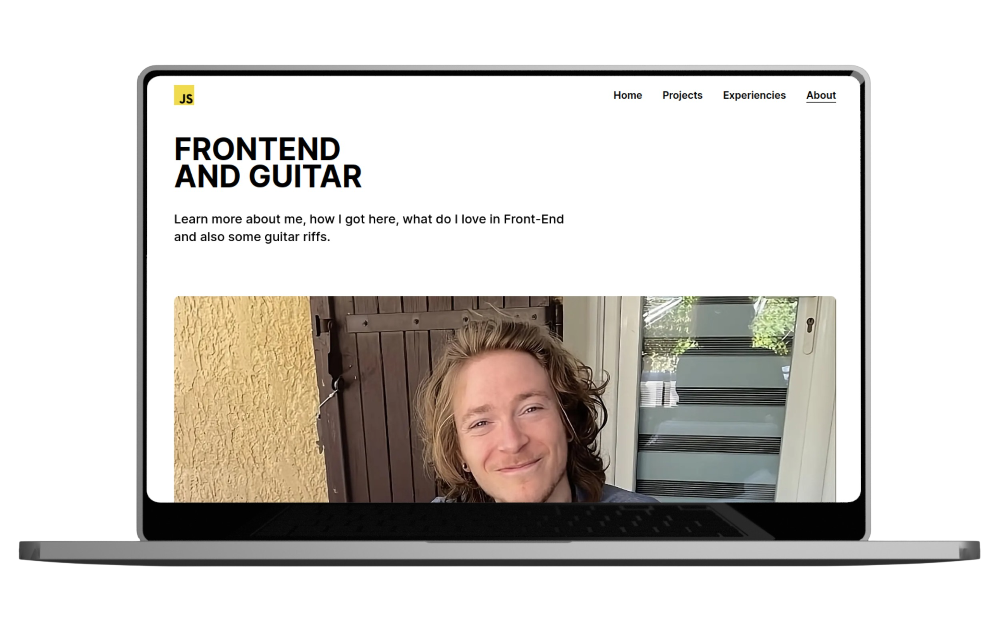

# Portfolio front



This repositery host my personal website code. The site itself show my CV, custom projects, and it's a good way to show my React guidelines. Also, I can try new feature that I'm not used to, like [`tailwind-css`](https://tailwindcss.com/) or [`Next.js`](https://nextjs.org/)

This is a [`Next.js`](https://nextjs.org/) project bootstrapped with [`create-next-app`](https://github.com/vercel/next.js/tree/canary/packages/create-next-app).

## Getting Started

First, run the development server:

```bash
npm run dev
# or
yarn dev
# or
pnpm dev
```

Then populate create and add a `.env` file at the project root with `DATABASE_URL`

Open [http://localhost:3000](http://localhost:3000) with your browser to see the result.

You can start editing the page by modifying `app/page.tsx`. The page auto-updates as you edit the file.

This project uses [`next/font`](https://nextjs.org/docs/basic-features/font-optimization) to automatically optimize and load Inter, a custom Google Font.

## Learn More

To learn more about Next.js, take a look at the following resources:

- [Next.js Documentation](https://nextjs.org/docs) - learn about Next.js features and API.
- [Learn Next.js](https://nextjs.org/learn) - an interactive Next.js tutorial.

You can check out [the Next.js GitHub repository](https://github.com/vercel/next.js/) - your feedback and contributions are welcome!

## Deploy on Vercel

Any push or merge on `main` will trigger a new deployment of the `main` branch.
